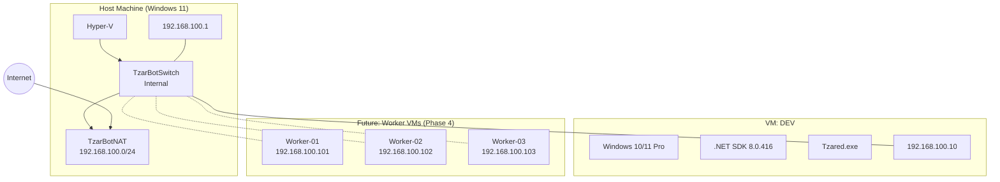

# TzarBot Infrastructure Documentation

**Ostatnia aktualizacja:** 2025-12-07
**Status:** Phase 0 COMPLETED

---

## Diagram architektury



---

## Specyfikacja maszyn

### Host Machine

| Parametr | Wartość |
|----------|---------|
| OS | Windows 11 |
| Hyper-V | Enabled |
| .NET SDK | 8.0 |

### VM: DEV

| Parametr | Wartość |
|----------|---------|
| Nazwa | DEV |
| OS | Windows 10/11 Pro (nieaktywowany) |
| RAM | 4 GB |
| CPU | 2 cores |
| Dysk | 60 GB (VHDX) |
| IP | 192.168.100.10 |
| Gateway | 192.168.100.1 |
| DNS | 8.8.8.8 |
| User | test (bez hasła) |
| .NET SDK | 8.0.416 |
| Gra | C:\Program Files\Tzared\Tzared.exe |

---

## Konfiguracja sieci

### Virtual Switch

| Parametr | Wartość |
|----------|---------|
| Nazwa | TzarBotSwitch |
| Typ | Internal |
| Host IP | 192.168.100.1/24 |

### NAT

| Parametr | Wartość |
|----------|---------|
| Nazwa | TzarBotNAT |
| Subnet | 192.168.100.0/24 |
| Status | Active |

### Alokacja IP

| Zakres | Przeznaczenie |
|--------|---------------|
| 192.168.100.1 | Host (gateway) |
| 192.168.100.10 | DEV VM |
| 192.168.100.101-199 | Worker VMs |

---

## Resource Limits

| Zasób | Limit | Notatki |
|-------|-------|---------|
| **RAM dla VM** | **10 GB** | HARD LIMIT |
| DEV VM | 4 GB | Development |
| Workers Pool | 6 GB | 3-6 workerów |

### Przykładowe konfiguracje workerów

| Konfiguracja | DEV | Workers | Total |
|--------------|-----|---------|-------|
| 3 workers x 2GB | 4 GB | 6 GB | 10 GB |
| 6 workers x 1GB | 4 GB | 6 GB | 10 GB |
| 4 workers x 1.5GB | 4 GB | 6 GB | 10 GB |

---

## Instrukcja odtworzenia środowiska

### 1. Włączenie Hyper-V (jako Administrator)

```powershell
Enable-WindowsOptionalFeature -Online -FeatureName Microsoft-Hyper-V -All
# Restart wymagany
```

### 2. Utworzenie sieci

```powershell
# Virtual Switch
New-VMSwitch -Name "TzarBotSwitch" -SwitchType Internal

# IP na hoście
New-NetIPAddress -IPAddress 192.168.100.1 -PrefixLength 24 -InterfaceAlias "vEthernet (TzarBotSwitch)"

# NAT
New-NetNat -Name "TzarBotNAT" -InternalIPInterfaceAddressPrefix 192.168.100.0/24
```

### 3. Utworzenie VM DEV

```powershell
# Utwórz VM
New-VM -Name "DEV" -MemoryStartupBytes 4GB -Generation 2 -NewVHDPath "C:\ProgramData\Microsoft\Windows\Virtual Hard Disks\DEV.vhdx" -NewVHDSizeBytes 60GB -SwitchName "TzarBotSwitch"

# Konfiguracja
Set-VMProcessor -VMName "DEV" -Count 2
Set-VM -VMName "DEV" -EnhancedSessionTransportType HvSocket
Set-VMFirmware -VMName "DEV" -EnableSecureBoot Off

# Podłącz ISO Windows
Add-VMDvdDrive -VMName "DEV" -Path "C:\path\to\Windows.iso"
$dvd = Get-VMDvdDrive -VMName "DEV"
Set-VMFirmware -VMName "DEV" -FirstBootDevice $dvd

# Uruchom
Start-VM -Name "DEV"
```

### 4. Konfiguracja Windows na VM

1. Zainstaluj Windows (pomiń aktywację)
2. Utwórz użytkownika: `test` (bez hasła)
3. Ustaw statyczne IP:
   - IP: 192.168.100.10
   - Maska: 255.255.255.0
   - Gateway: 192.168.100.1
   - DNS: 8.8.8.8

### 5. Instalacja oprogramowania na VM

```powershell
# .NET SDK
winget install Microsoft.DotNet.SDK.8

# Lub pobierz z https://dotnet.microsoft.com/download/dotnet/8.0
```

### 6. Instalacja gry Tzar

1. Skopiuj `tzared.windows.zip` na VM
2. Rozpakuj do `C:\Program Files\Tzared\`
3. Uruchom `Tzared.exe` i skonfiguruj tryb okienkowy

---

## Tworzenie template dla workerów

Po skonfigurowaniu DEV można utworzyć template:

```powershell
# Wyłącz VM
Stop-VM -Name "DEV" -Force

# Eksportuj jako template
Export-VM -Name "DEV" -Path "C:\Hyper-V\Templates"

# Lub skopiuj VHDX
Copy-Item "C:\ProgramData\Microsoft\Windows\Virtual Hard Disks\DEV.vhdx" "C:\Hyper-V\Templates\TzarBot-Base.vhdx"

# Uruchom ponownie DEV
Start-VM -Name "DEV"
```

---

## Weryfikacja środowiska

### Checklist

- [x] Hyper-V włączony
- [x] TzarBotSwitch utworzony
- [x] TzarBotNAT aktywny
- [x] VM DEV utworzona i uruchomiona
- [x] Windows zainstalowany
- [x] Sieć skonfigurowana (IP statyczne)
- [x] Internet działa na VM
- [x] .NET SDK 8.0.416 zainstalowany
- [x] Gra Tzar zainstalowana i działa
- [x] Tryb okienkowy włączony

### Testy połączenia

```cmd
# Z VM do hosta
ping 192.168.100.1    # DZIAŁA

# Z VM do internetu
ping 8.8.8.8          # DZIAŁA

# Z hosta do VM
ping 192.168.100.10   # Blokowany przez firewall (nieistotne)
```

---

## Powiązane dokumenty

| Dokument | Ścieżka |
|----------|---------|
| Environment Settings | `env_settings.md` |
| Phase 0 Backlog | `project_management/backlog/phase_0_backlog.md` |
| Phase 4 Backlog (Workers) | `project_management/backlog/phase_4_backlog.md` |

---

## Historia zmian

| Data | Zmiana | Autor |
|------|--------|-------|
| 2025-12-07 | Utworzenie dokumentu | Claude |
| 2025-12-07 | Phase 0 completed | Claude |
