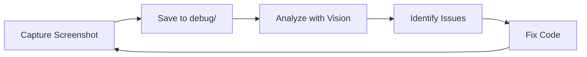
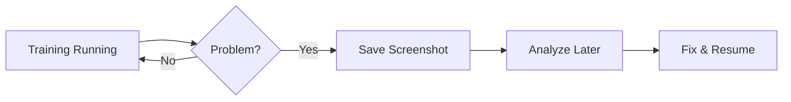

# Przewodnik Testowania Vision dla TzarBot

**Data:** 2025-12-07
**Status:** Do implementacji

---

## 1. Zastosowania Vision w Projekcie

Claude posiada wbudowane możliwości Vision, które mogą być wykorzystane w projekcie TzarBot:

### 1.1 Debugowanie Screen Capture
- Weryfikacja poprawności przechwytywania ekranu
- Analiza czy preprocessing obrazu zachowuje istotne informacje
- Porównanie klatek przed i po downscale

### 1.2 Analiza Ekranów Gry
- Identyfikacja elementów UI gry Tzar
- Tworzenie template'ów dla GameStateDetector
- Weryfikacja detekcji Victory/Defeat screens

### 1.3 Debugowanie Zachowania Bota
- Analiza screenshotów z sesji treningowych
- Identyfikacja sytuacji problematycznych (stuck, crash)
- Zrozumienie dlaczego bot podejmuje określone decyzje

---

## 2. Jak Używać Vision

### 2.1 Bezpośrednie Użycie w Konwersacji

```
User: [Załącza screenshot z gry]
User: Co widzisz na tym screenshocie? Jakie elementy UI są widoczne?

Claude: [Analizuje obraz i opisuje widoczne elementy]
```

### 2.2 Użycie Read Tool dla Plików Obrazów

```
Claude używa Read tool z path do pliku obrazu:
Read(file_path: "C:\Users\maciek\ai_experiments\tzar_bot\debug\screenshot_001.png")
```

### 2.3 Przykładowe Prompty

**Analiza UI:**
```
Przeanalizuj ten screenshot z gry Tzar. Zidentyfikuj:
1. Lokalizację minimapy
2. Pasek zasobów (złoto, drewno, kamień)
3. Panel wybranych jednostek
4. Przyciski akcji
```

**Weryfikacja Detekcji:**
```
Czy ten screenshot pokazuje ekran zwycięstwa (Victory) czy przegranej (Defeat)?
Jakie elementy wizualne pozwalają to stwierdzić?
```

**Debugowanie Bota:**
```
Bot zatrzymał się w tej sytuacji. Przeanalizuj screenshot i zaproponuj:
1. Co mogło spowodować zatrzymanie?
2. Jaką akcję powinien wykonać bot?
3. Czy są widoczne elementy wskazujące na problem?
```

---

## 3. Struktura Katalogów dla Debugowania

```
tzar_bot/
├── debug/
│   ├── screenshots/           # Surowe screenshoty
│   │   ├── game_001.png
│   │   ├── game_002.png
│   │   └── ...
│   ├── preprocessed/          # Po preprocessing
│   │   ├── frame_001.png
│   │   └── ...
│   ├── templates/             # Template'y dla detekcji
│   │   ├── victory_screen.png
│   │   ├── defeat_screen.png
│   │   ├── minimap_region.png
│   │   └── ...
│   └── problem_cases/         # Problematyczne sytuacje
│       ├── stuck_001.png
│       └── ...
```

---

## 4. Workflow Testowania

### 4.1 Tworzenie Template'ów

1. Uruchom grę Tzar
2. Przechwyć screenshoty różnych stanów gry
3. Użyj Vision do identyfikacji regionów:
   ```
   Claude: Przeanalizuj ten screenshot. Wskaż dokładne współrzędne (x, y, width, height) dla:
   - Minimapy
   - Paska zasobów
   - Panelu jednostek
   ```
4. Wytnij regiony jako template'y
5. Zweryfikuj template'y na różnych screenshotach

### 4.2 Testowanie Detekcji

1. Przygotuj zestaw testowy screenshotów:
   - 10x Victory screen
   - 10x Defeat screen
   - 10x In-game (różne sytuacje)
   - 5x Menu
   - 5x Loading screen

2. Dla każdego screenshotu:
   ```
   Claude: Przeanalizuj ten obraz i określ stan gry:
   - Victory
   - Defeat
   - InGame
   - Menu
   - Loading
   - Unknown

   Uzasadnij swoją odpowiedź.
   ```

3. Porównaj wyniki z oczekiwanymi

### 4.3 Debugowanie Problemów

1. Gdy bot się zatrzymuje, zapisz screenshot
2. Przeanalizuj z użyciem Vision:
   ```
   Claude: Bot zatrzymał się w tej sytuacji. Przeanalizuj:
   1. Stan gry (czy gra działa?)
   2. Widoczne jednostki i budynki
   3. Potencjalne problemy (np. zablokowana kamera)
   4. Sugerowana akcja
   ```

---

## 5. Ograniczenia Vision

### 5.1 Rozdzielczość
- Bardzo małe elementy mogą być trudne do analizy
- Zalecana minimalna rozdzielczość: 720p

### 5.2 Szybkość
- Vision nie jest przeznaczone do real-time analysis
- Używaj do debugowania, nie do inference

### 5.3 Konsystencja
- Różne sesje mogą dawać nieco różne opisy
- Dla krytycznych detekcji używaj template matching (OpenCV)

---

## 6. Integracja z Workflow

### 6.1 Podczas Developmentu



### 6.2 Podczas Treningu



---

## 7. Przykłady Użycia

### Przykład 1: Identyfikacja Regionów UI

**Input:** Screenshot głównego ekranu gry

**Prompt:**
```
Zidentyfikuj na tym screenshocie z gry Tzar następujące regiony UI
i podaj ich przybliżone współrzędne (x, y, szerokość, wysokość)
zakładając rozdzielczość 1920x1080:

1. Minimapa (lewy dolny róg)
2. Pasek zasobów (górna część ekranu)
3. Panel informacji o jednostce (dolna część)
4. Przyciski akcji (prawy dolny róg)
```

### Przykład 2: Weryfikacja Stanu Gry

**Input:** Screenshot z potencjalnym ekranem końca gry

**Prompt:**
```
Czy ten screenshot pokazuje zakończenie gry?
- Jeśli tak, czy jest to wygrana czy przegrana?
- Jakie elementy wizualne (kolory, tekst, ikony) pozwalają to stwierdzić?
- Czy widoczne są jakieś statystyki końcowe?
```

### Przykład 3: Analiza Problemu

**Input:** Screenshot z sesji gdzie bot się zatrzymał

**Prompt:**
```
Bot AI zatrzymał się w tej sytuacji i nie wykonuje żadnych akcji.
Przeanalizuj screenshot i odpowiedz:

1. Czy gra jest w normalnym stanie (in-game)?
2. Czy widoczne są jakieś dialogi/popupy blokujące?
3. Czy są widoczne jednostki gracza do kontrolowania?
4. Jaka mogła być przyczyna zatrzymania?
5. Jaka akcja powinna być wykonana?
```

---

## 8. Następne Kroki

1. [ ] Utworzyć katalog `debug/` z podkatalogami
2. [ ] Przechwycić pierwsze screenshoty z gry
3. [ ] Przetestować Vision na screenshotach
4. [ ] Utworzyć zestaw template'ów
5. [ ] Udokumentować współrzędne regionów UI
